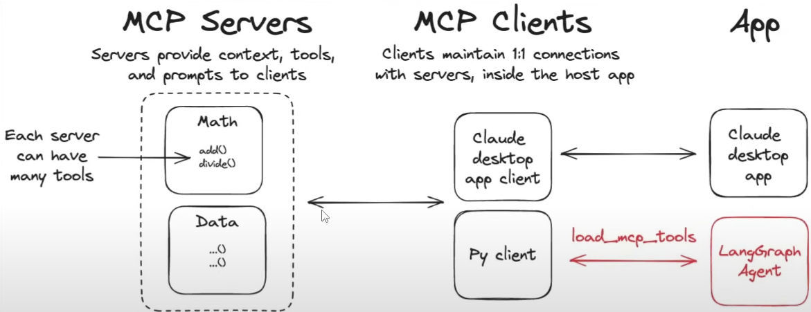

# MCP Example:




✅ **Let’s break down the working flow of MCP based on the based on log**
```log
    INFO:llm:Initializing AzureChatOpenAI with model=gpt-4o-ocr, temperature=0.9
    INFO:httpx:HTTP Request: POST http://localhost:8000/mcp "HTTP/1.1 307 Temporary Redirect"
    INFO:httpx:HTTP Request: POST http://localhost:8000/mcp/ "HTTP/1.1 200 OK"
    INFO:mcp.client.streamable_http:Received session ID: 281e3482ae24487e8093ad904de38e50
    INFO:httpx:HTTP Request: POST http://localhost:8000/mcp "HTTP/1.1 307 Temporary Redirect"
    INFO:httpx:HTTP Request: GET http://localhost:8000/mcp "HTTP/1.1 307 Temporary Redirect"
    INFO:httpx:HTTP Request: POST http://localhost:8000/mcp/ "HTTP/1.1 202 Accepted"
    INFO:httpx:HTTP Request: GET http://localhost:8000/mcp/ "HTTP/1.1 200 OK"
    INFO:httpx:HTTP Request: POST http://localhost:8000/mcp "HTTP/1.1 307 Temporary Redirect"
    INFO:httpx:HTTP Request: POST http://localhost:8000/mcp/ "HTTP/1.1 200 OK"
    INFO:httpx:HTTP Request: DELETE http://localhost:8000/mcp "HTTP/1.1 307 Temporary Redirect"
    INFO:httpx:HTTP Request: DELETE http://localhost:8000/mcp/ "HTTP/1.1 200 OK"
    Successfully loaded tools: ['addition', 'subtraction', 'multiplication', 'division', 'wheather']
    INFO:httpx:HTTP Request: POST https://aiqwiphub9846884880.cognitiveservices.azure.com/openai/deployments/gpt-4o-ocr/chat/completions?api-version=2025-01-01-preview "HTTP/1.1 200 OK"
    INFO:httpx:HTTP Request: POST https://aiqwiphub9846884880.cognitiveservices.azure.com/openai/deployments/gpt-4o-ocr/chat/completions?api-version=2025-01-01-preview "HTTP/1.1 200 OK"
    INFO:httpx:HTTP Request: POST https://aiqwiphub9846884880.cognitiveservices.azure.com/openai/deployments/gpt-4o-ocr/chat/completions?api-version=2025-01-01-preview "HTTP/1.1 200 OK"
    Math response: The result of \((3 + 5) \times 12\) is \(96\).
    INFO:httpx:HTTP Request: POST https://aiqwiphub9846884880.cognitiveservices.azure.com/openai/deployments/gpt-4o-ocr/chat/completions?api-version=2025-01-01-preview "HTTP/1.1 200 OK"
    INFO:httpx:HTTP Request: POST http://localhost:8000/mcp "HTTP/1.1 307 Temporary Redirect"
    INFO:httpx:HTTP Request: POST http://localhost:8000/mcp/ "HTTP/1.1 200 OK"
    INFO:mcp.client.streamable_http:Received session ID: 08d73d4f95e0419e87dd927c41a74209
    INFO:httpx:HTTP Request: POST http://localhost:8000/mcp "HTTP/1.1 307 Temporary Redirect"
    INFO:httpx:HTTP Request: GET http://localhost:8000/mcp "HTTP/1.1 307 Temporary Redirect"
    INFO:httpx:HTTP Request: POST http://localhost:8000/mcp/ "HTTP/1.1 202 Accepted"
    INFO:httpx:HTTP Request: GET http://localhost:8000/mcp/ "HTTP/1.1 200 OK"
    INFO:httpx:HTTP Request: POST http://localhost:8000/mcp "HTTP/1.1 307 Temporary Redirect"
    INFO:httpx:HTTP Request: POST http://localhost:8000/mcp/ "HTTP/1.1 200 OK"
    INFO:httpx:HTTP Request: DELETE http://localhost:8000/mcp "HTTP/1.1 307 Temporary Redirect"
    INFO:httpx:HTTP Request: DELETE http://localhost:8000/mcp/ "HTTP/1.1 200 OK"
    INFO:httpx:HTTP Request: POST https://aiqwiphub9846884880.cognitiveservices.azure.com/openai/deployments/gpt-4o-ocr/chat/completions?api-version=2025-01-01-preview "HTTP/1.1 200 OK"
    Weather response: The weather in California is sunny.
```

This is what’s happening *behind the scenes* when your **LLM agent interacts with MCP tools (servers)** using **MCP Client** over HTTP + SSE (or HTTP with session management).

---

## 🚀 **MCP Working Flow**

### 1️⃣ **Client initiates a tool request**

👉 Your LLM (via MCP client) sends a **JSON-RPC request** to an MCP server:

```json
{
  "jsonrpc": "2.0",
  "method": "addition",
  "params": {"a": 3, "b": 5},
  "id": "abc123"
}
```

➡ This is sent over **HTTP POST** to `http://localhost:8000/mcp`.

---

### 2️⃣ **Redirect & session management**

👉 The server responds with:

```
HTTP/1.1 307 Temporary Redirect
Location: /mcp/
```

➡ The MCP client follows this redirect → starts working on the correct endpoint (`/mcp/`).

👉 A session ID is generated:

```
INFO: Received session ID: 81f20cd1fed947b985cc1c7eb3dee9a4
```

➡ **Purpose**:

* Session ID helps track tool calls, context, or tool chain execution for that session.

---

### 3️⃣ **Server processes the tool call**

👉 The server accepts the task:

```
HTTP/1.1 202 Accepted
```

➡ Means the server **queued or started** processing the request.

👉 Client polls for result:

```
GET /mcp/ → 200 OK
```

➡ MCP client fetches final result when ready.

---

### 4️⃣ **Server sends the result**

✅ Example result:

```
Math response: The result of (3 + 5) × 12 is 96.
```

✅ Example weather response:

```
Weather response: The weather in California is sunny.
```

➡ The server has processed tools like `addition`, `multiplication`, or `weather`, and sent the final JSON-RPC **result** back.

---

### 5️⃣ **Session cleanup**

👉 When finished:

```
DELETE /mcp → 200 OK
```

➡ The session is closed; server frees resources, and context is cleared (unless persistent memory is configured).

---

## 🌐 **Summary of Flow**

```
LLM → MCP Client → MCP Server (via HTTP + JSON-RPC)
↓
Tool call request → Session established → Task processed
↓
Streaming/polling result → Result sent → Session closed
```

---

## 🧠 **Why this is powerful**

* **Dynamic tool calling**: LLM can call any tool without pre-defining API contracts.
* **Session-based context**: Each chain of tool calls can share state.
* **Secure & modular**: Tools are isolated; each server handles its own logic.